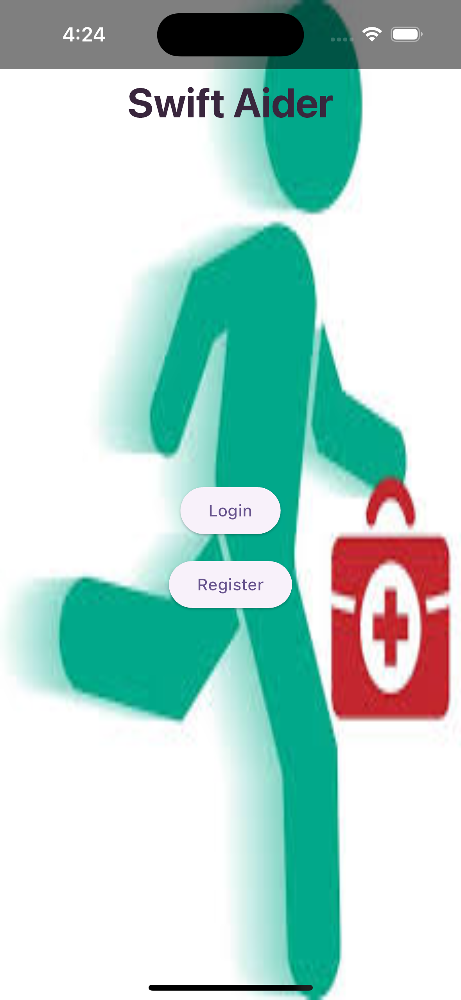
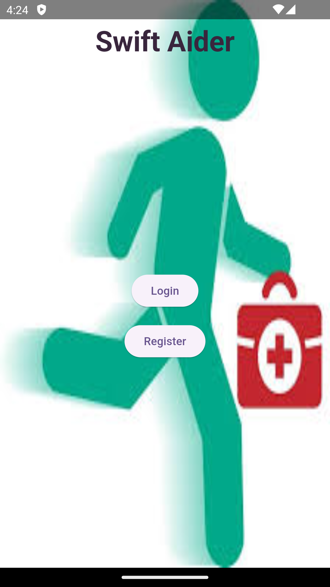
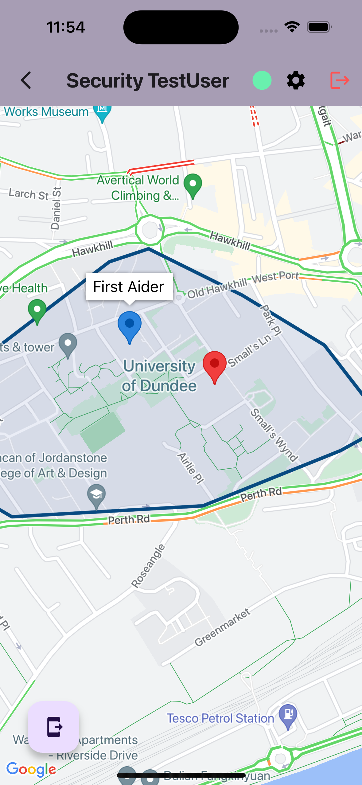
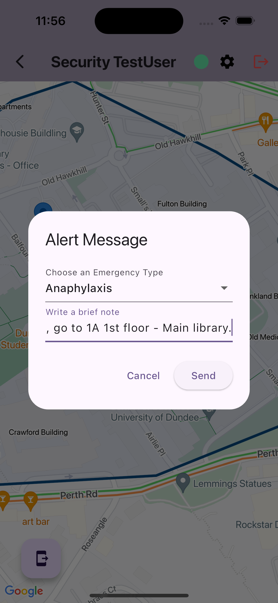
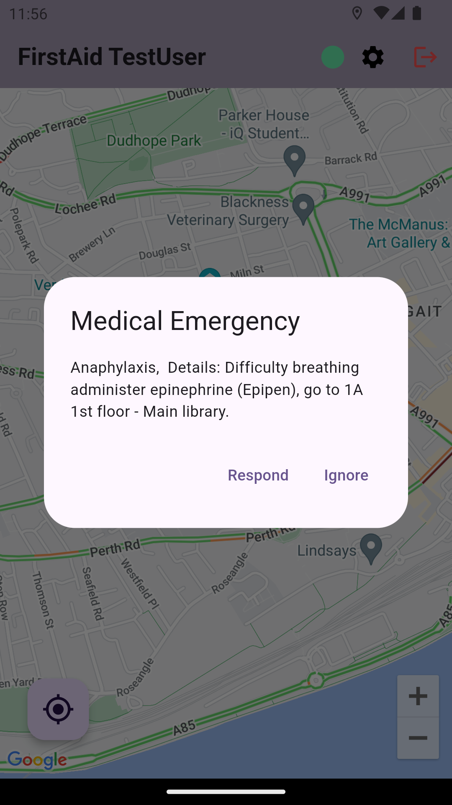
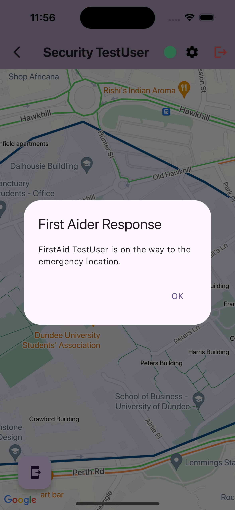
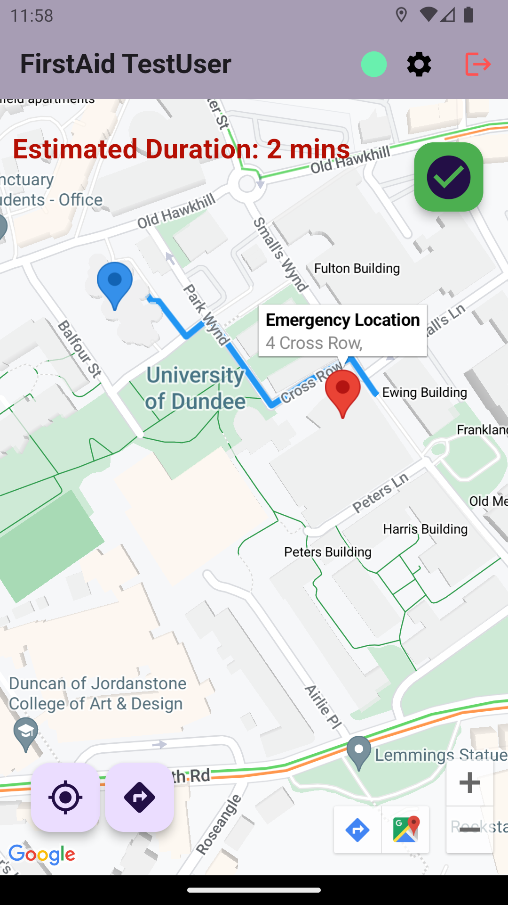
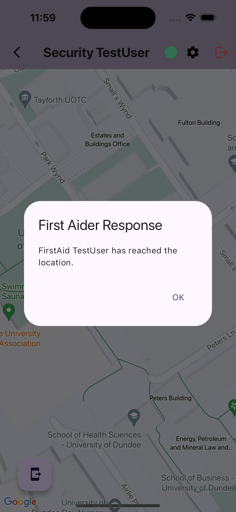

# Swift Aider App - First-Aid Emergency Management Application
MSc Project 2024- Alerting First-Aiders On Mobile Based On Their Localisation

## Introduction

In emergency situations, prompt and effective response is critical to ensuring the safety and well-being of individuals. The University of Dundee maintains an internal emergency contact number and a dedicated security team to respond to such incidents. However, the current system lacks the capability to directly connect with the nearest registered first-aider, which can delay response times in medical emergencies.

The **Swift Aider App** is designed to bridge this gap by providing an effective tool for the university's security personnel and designated first-aid responders. Leveraging the capabilities of Google Maps, the app aims to significantly improve response times, ensuring that help reaches those in need as quickly as possible. The application features an intuitive interface that prioritizes user-friendliness and accessibility, catering to individuals regardless of their familiarity with the campus layout.

## Application Overview

The Swift Aider App functions as a cross-platform mobile application, compatible with both Android and iOS smartphones. The app utilizes geolocation technology and push notifications to deliver precise navigation guidance and real-time updates, ensuring that first-aiders can be alerted and dispatched efficiently.

## App Screenshots

<table>
  <tr>
    <td>
      
    </td>
    <td>
      
    </td>
    <td>
      
    </td>
    <td>
      
    </td>
    <td>
      
    </td>
     <td>
      
    </td>
    <td>
      
    </td>
      <td>
      
    </td>
  </tr> 
</table>


### Key Features

1. **Send Alert:**
   - Security personnel can mark the emergency location on the map.
   - The app identifies and displays the nearest online first-aiders.
   - Users can dispatch an alert to these first-aiders by selecting the "Send Alert" button and providing details regarding the medical emergency.

2. **Receive Alert:**
   - First-aiders receive alerts and can choose to either respond or ignore them.
   - Upon responding, the emergency location is marked on the map, and the user can click the "Get Directions" button to navigate to the location.
   - The "Arrived" button notifies security of their arrival.

3. **Responder Actions:**
   - Security is notified when a first-aider responds and arrives at the emergency location.

4. **Incident Dashboard:**
   - Security can view a list of opened incidents in their dashboard, allowing for efficient management of ongoing emergencies.

### Technology Stack

- **Flutter:** Enables cross-platform mobile application development for both iOS and Android.
- **Firebase:** Powers the backend, providing services such as Firebase Authentication for secure user login, Firestore for real-time database management, and Firebase Cloud Messaging for push notifications.
- **Google Cloud Platform:** Integrates mapping and navigation functionalities using the Maps SDK for Android and iOS, and the Directions API for accurate geolocation services and real-time navigation guidance.

### Database Overview

The application relies on **Firestore**, a NoSQL cloud database, to manage critical data necessary for emergency response operations. This database securely stores user personal information collected during registration, facilitates real-time tracking of first-aiders' locations upon signing in, and maintains comprehensive logs of incident reports. This structured data enables the app to quickly identify and dispatch the nearest responders, thereby improving response times and resource allocation.

## Installation and Running on iOS and Android Simulators

To install and Run your Flutter app on iOS and Android simulators, follow the steps outlined below. This process includes setting up Flutter, configuring Firebase, and integrating Google Cloud APIs.

### 1. Install Flutter
Follow the official Flutter documentation to set up Flutter on your machine. This includes downloading the SDK, setting up your environment, and configuring your IDE.

- [Flutter Installation Guide](https://docs.flutter.dev/get-started/install)

### 2. Set Up Your Flutter Project
- Create a new Flutter project or open an existing one.
- Ensure you have configured the project for both iOS and Android platforms.

### 3. Firebase Setup
Integrate Firebase into your Flutter project to use Firebase services like Authentication, Firestore, and Cloud Messaging.

- [Add Firebase to Your Flutter App](https://firebase.flutter.dev/docs/overview)

**Firebase for Android**:
- Add `google-services.json` to your `android/app` directory.

**Firebase for iOS**:
- Add `GoogleService-Info.plist` to your `ios/Runner` directory.

### 4. Google Cloud API Integration
For mapping and geolocation functionalities, integrate Google Maps SDK and the Directions API.

- [Google Maps for Flutter](https://pub.dev/packages/google_maps_flutter)
- [Google Cloud Platform Documentation](https://cloud.google.com/docs)

### 5. Run on Android Emulator
- Launch an Android emulator via Android Studio.
- Use the following command to run the app on the Android emulator:
  ```bash
  flutter run


